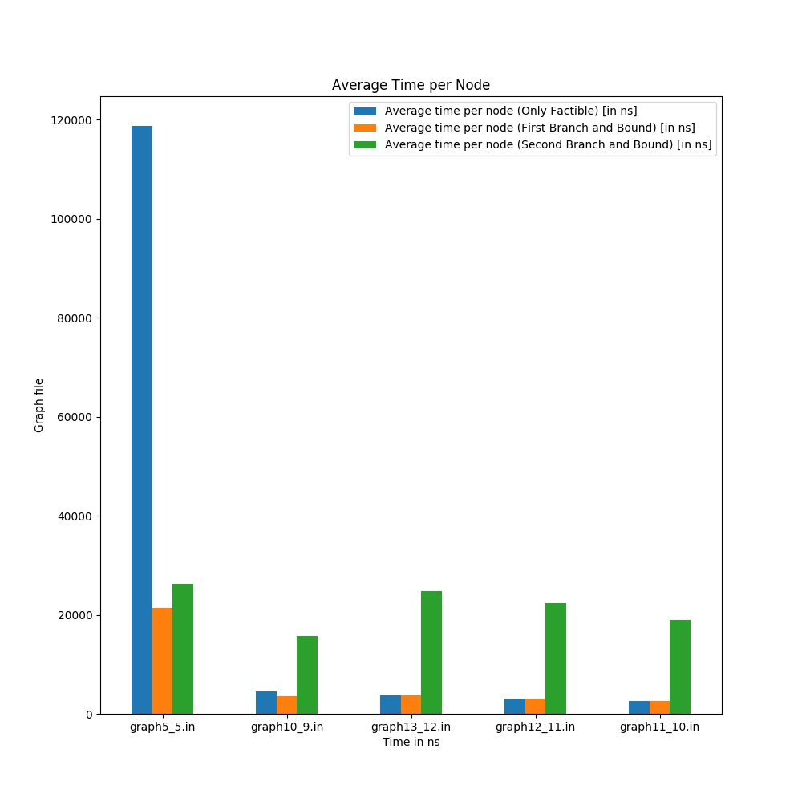
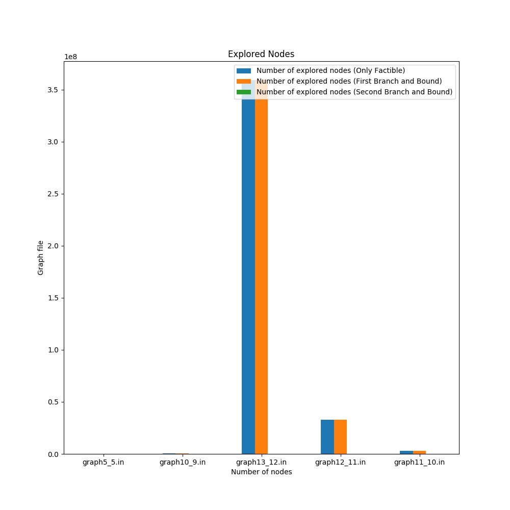
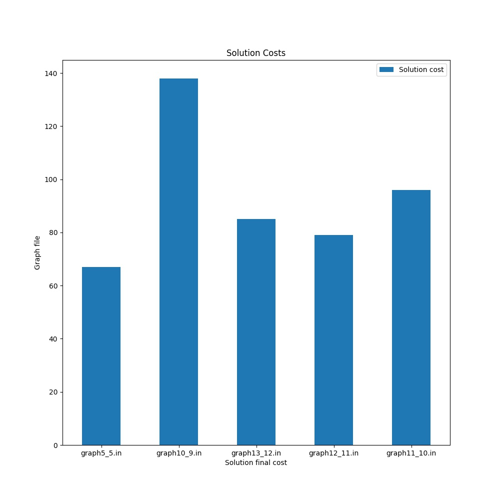
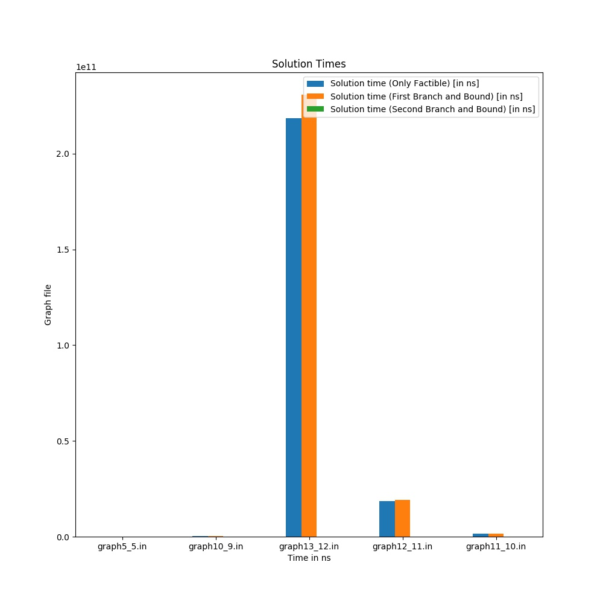

# The Traveling Salesman Problem.
[](LICENSE)
[](https://travis-ci.com/FrederickBor/TravelingSalesman)

## About this repo.

This is a solution for the traveling salesman problem with branch and bound.

On this repo you can find some Java Classes and one python script, the last one is only for generate automatically some graphs with the solution given by the Main.java.

The graphs generated are:

Average of time per explored node | Number of explored nodes
:------------: | :-------------:
 | 

Solution cost | Solutions times
:------------: | :-------------:
 | 

## How to add a new graph

To add a new graph you just need to add a `.in` file inside graphs folder.

The structure for those files is:

```graph.in
bidirectional=false
source;destination;cost
0;1;2
1;0;1
1;2;1
2;0;5
```

## How to execute it.

```bash
$ javac Main.java
$ java Main
```

## Author.

Frederick Ernesto Borges Noronha &nbsp; [](https://github.com/FrederickBor)

## License

This project is licensed under the MIT License - see the [LICENSE](LICENSE) file for details